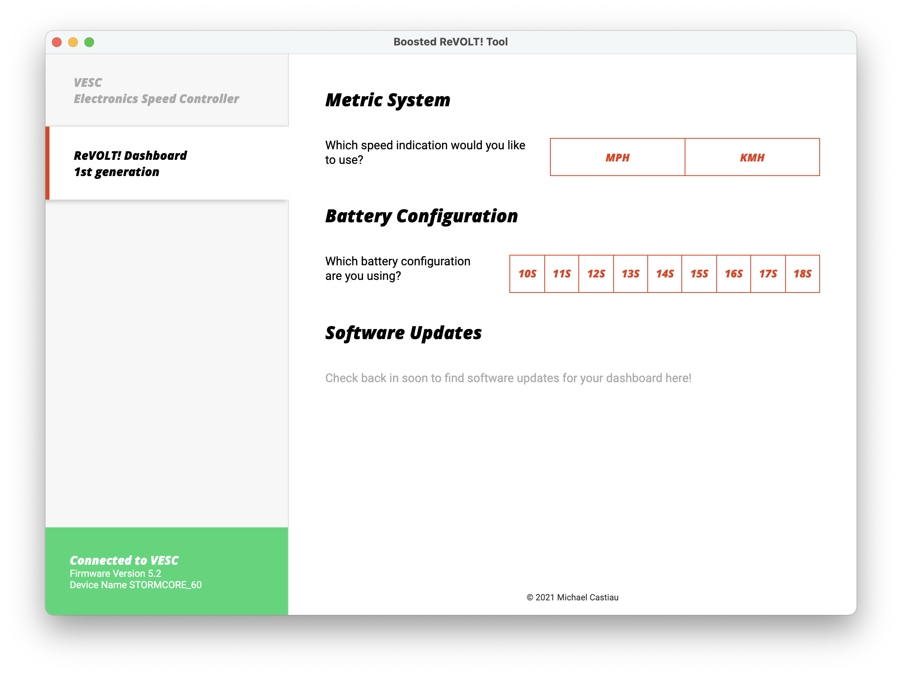

# Boosted ReVOLT! Software Tool

This repository contains the source code and downloadable executables for the Boosted ReVOLT! desktop software tool. The tool enables an end user to connect to a VESC and update VESC and/or ReVOLT! product settings.

It also provides firmware updates for Boosted ReVOLT! products.

## Download

Under construction, come back later!

## Products
### Boosted ReVOLT! Dashboard

Available settings:
- metric system
- battery configuration

Firmware updates of the dashboard are made available through this tool.

## Contributing

This project uses Electron and Angular to build a cross-platform desktop application. Backend is running a Nodejs server with NestJs. To contribute, create a merge request and add @MichaelCastiau as reviewer.
